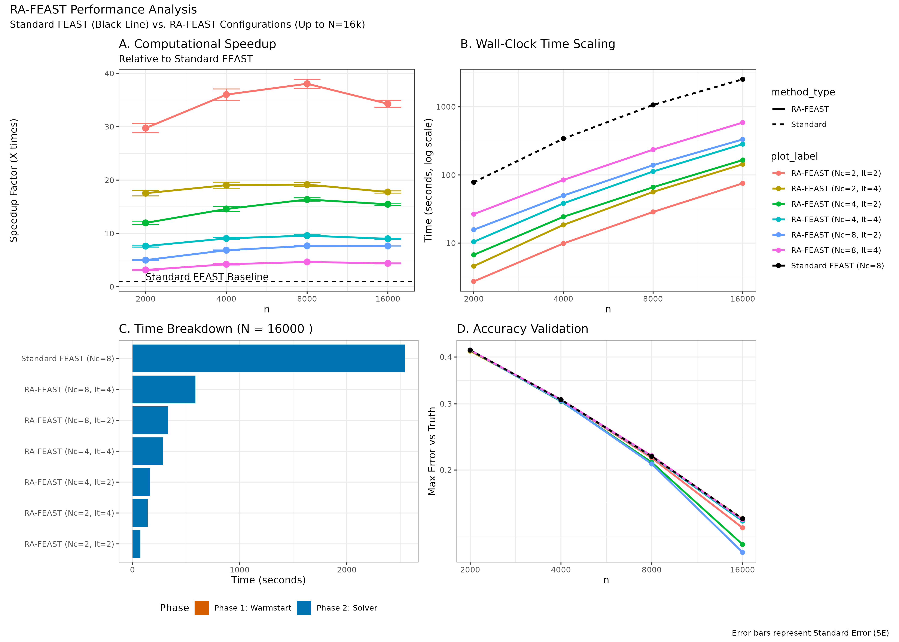

# RA-FEAST: Randomized-Accelerated FEAST Solver

**A hybrid eigensolver for large-scale sparse problems in statistical computing.**

RA-FEAST connects the robustness of the FEAST contour-integral solver (v4.0) with the speed of Randomized Numerical Linear Algebra (RandNLA). By using a randomized subspace warmstart, we aggressively reduce the required quadrature nodes ($N_c$) and refinement iterations, achieving significant speedups over standard spectral methods.


*Figure 1: RA-FEAST achieves up to 38x speedup over Standard FEAST on sparse graph Laplacians ($N=16,000$) while maintaining statistical accuracy.*

## Features

* **Rcpp Interface:** Seamless integration between R and the optimized FEAST C/Fortran library.
* **Sparse Support:** Native handling of `dgCMatrix` (Matrix package) for memory efficiency.
* **Warmstart Wrapper:** Custom C++ interface to inject randomized initial guesses directly into the FEAST solver routine.
* **Reproducible:** Includes SLURM job array scripts for large-scale benchmarking on high-performance clusters.

## Installation

### Prerequisites
This package relies on the **FEAST Eigenvalue Solver v4.0**. Due to file size limits, the binary library files are not hosted directly in this repository.

1.  **Download FEAST v4.0** from the [official website](http://www.feast-solver.org/).
2.  Extract the downloaded folder and rename it to `FEAST`.
3.  Place the `FEAST` folder into the root of this package directory. The structure must look like this:
    ```text
    rafeast535/
    ├── FEAST/          <-- You put this here
    │   ├── 4.0/
    │       ├── include/
    │       └── lib/
    ├── R/
    ├── src/
    └── DESCRIPTION
    ```
4.  **Install the package** via R:
    ```r
    # Install devtools if you don't have it
    install.packages("devtools")
    
    # Install from local directory
    devtools::install(".")
    ```

## Usage Example

```r
library(rafeast535)
library(Matrix)

# 1. Create a sparse symmetric matrix (Graph Laplacian proxy)
n <- 1000
L <- Matrix::rsparsematrix(n, n, density = 0.01, symmetric = TRUE)

# 2. Run RA-FEAST (Fast Mode: Nc=2)
# We target m0=40 eigenvalues in the interval [0.0, 5.0]
# Nc=2 uses the aggressive quadrature reduction described in the paper.
res <- rafeast_sparse(L, lambda_min=0.0, lambda_max=5.0, m0=40, Nc=2)

# 3. Inspect Results
print(head(res$values))
